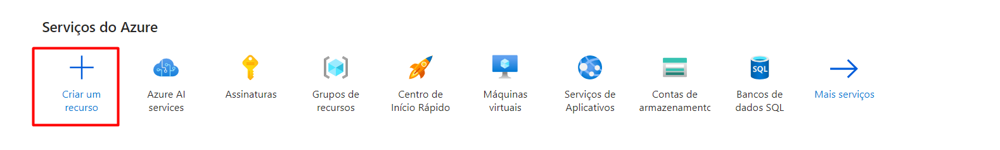

# Reconhecimento Facial e Tansformações de Imagens em Dados no Azure ML

Atualmente, muitos processos cotidianos estão sendo transformados e otimizados pela visão computacional e processamento de imagens, o que torna essencial entender esses processos e como a Microsoft Azure oferece soluções nesse campo. 

Desse modo, no laboratório prático, investigamos o Vision Studio da Microsoft Azure, destacando sua eficácia em processamento de imagens e visão computacional. Demonstramos seu uso em reconhecimento facial, detecção de objetos e classificação de imagens, revelando como ele transforma imagens em análises profundas e insights valiosos. O Vision Studio exemplifica como a inteligência artificial pode ser integrada em soluções práticas e inovadoras.

## Como Configurar:

Para configurar o ambiente, inicialmente você irá acessar a opção **Criar um Recurso.**

E procurar pela opção “Azure AI services”
Se você encontrar essa opção e ela não tiver um “Criar recurso” em baixo dela.

Você poderá pesquisar pelo nome “Azure AI services”, acessar a página e clicar  **Azure AI services multi-service account** e em “Create”

Feito isso, o próximo passo é configurar o ambiente de trabalho, seguindo as seguintes configurações:

- **Assinatura**: Sua assinatura Azure.
- **Grupo de recursos**: Selecione ou crie um grupo de recursos com um nome único.
- **Região**: East US.
- **Nome**: Insira um nome único.
- **Nível de preços**: Standard S0.
- **Ao marcar esta caixa, reconheço que li e entendi todos os termos abaixo**: Selecionado.

Clique em Criar + Examinar e está tudo pronto.

Feito a criação do recurso, será necessário você acessar o site [https://portal.vision.cognitive.azure.com/?azure-portal=true](https://portal.vision.cognitive.azure.com/?azure-portal=true)

para acessar o **Vision Studio.**

Conecte a sua conta onde está o mesmo diretório do recurso que você criou anteriormente.

Feito isso, na página inicial você irá clicar em “View all resources” para poder linkar seu workspace.

Selecione seu recurso e clique na opção “Select as default resource”

Definido como default, poderá voltar a tela inicial e os recursos estarão disponíveis para serem usados:

## Usando o Recurso Face:

Para acessar o recurso de identificação de faces, selecione a aba **Face** e o item **Detect faces in an image**

Entrando nesse item, você encontrará a seguinte página

Descrevendo um pouco sobre ele, temos duas opções, selecionar algumas imagens de exemplo ou selecionar nossas próprias fotos.

Porém lembre de deixar essa caixa de seleção marcada, caso contrário, o programa não irá funcionar corretamente.

Primeiramente, podemos fazer um teste com as imagens de exemplo que a própria plataforma oferece.

Selecionando qualquer das imagens, o software irá fazer o reconhecimento e retornar se encontrou uma face ou não, e se essa face está ou não com máscara.

Também é possível fazer com outras fotos que selecionarmos, e o interessante é que, se usarmos ele em uma foto em grupo, ele identificará todas as faces

Podemos usar esse tipo de processamento para, por exemplo, identificar a quantidade de pessoas presente dentro da foto.

No caso da foto anterior, o programa diz que existem 12 pessoas sem máscara na foto, o que se contarmos, se mostra ser verdade.

Obviamente, a qualidade da foto interfere no processamento

Nesse exemplo anterior, pegue uma turma de Jovem Aprendizes e é possível observar que ele identificou poucas faces na imagem, sendo bem específico, ele conseguiu identificar apenas 22 faces, porém, como podemos ver, tem muito mais pessoas dentro da sala.

Desse modo, é possível inferir que a qualidade da imagem, principalmente em relação ao rosto, acaba interferindo na identificação do mesmo.

Porém, esse tipo de identificação abre um leque de possibilidades muito grande e um processamento rápido e eficaz pode auxiliar em várias situações, sendo bastante útil por exemplo, na identificação de máscara durante a pandemia.

## Usando o recurso de extração de texto em imagem:

Outro recurso bastante interessante é o de extração de texto em imagem.

Para acessa-lo, basta ir na aba **Optical character recognition  e o item Extract text from images**

Da mesma forma que o recurso de detecção de imagem, você precisa marcar a caixa de seleção.

Além disso, você também tem acesso a algumas imagens de exemplo e pode inserir suas próprias imagens.

Você insere uma foto e o resultado aparecerá ao lado.

Esse tipo de identificação é muito importante, pois possui a capacidade de tornar o conteúdo textual em imagens acessível para pessoas com deficiência visual, facilitar a indexação e busca de informações, automatizar tarefas de extração de dados, permitir tradução e análise de sentimentos em diferentes idiomas, e contribuir para a verificação de autenticidade de documentos, abrangendo áreas como acessibilidade, organização de dados e automação de processos.

Outra possível utilização é para identificar placas de carro

Porém da mesma forma que o reconhecimento de face, a qualidade da foto poderá interferir na identificação dos textos presente na imagem.

## Usando sistema de análise de imagem:

Além desses outros dois modelos, podemos fazer o reconhecimento das imagens, colocando uma pequena descrição sobre o que tem na imagem.

Para acessarmos esse recurso, será necessário entrar na aba **Image analysis** e no item **Add captions to images**.

Novamente, apenas certifique-se de marcar essa caixa de seleção.

Como o título sugere, iremos detalhar as imagens, ou seja, adicionar legendas a elas. Isso é muito importante, principalmente com relação a acessibilidade.

Da mesma forma que os dois processos anteriores, a Vision Studio fornece algumas imagens de exemplos e você pode colocar suas próprias imagens.

## Conclusão:

Vale a pena destacar os serviços de "Face", "Extract text from images" e "Add captions to images" do Vision Studio, pois eles representam avanços significativos na área de visão computacional, isto é, o serviço "Face" permite reconhecer e analisar características faciais, facilitando aplicações em segurança e personalização de serviços, o  "Extract text from images" é crucial para digitalização e acessibilidade de informações, convertendo imagens em texto editável, e por fim o "Add captions to images" melhora a interação com conteúdo visual, gerando descrições automáticas que tornam as imagens mais acessíveis e compreensíveis. 

Juntos, esses serviços destacam o potencial da inteligência artificial em transformar a maneira como interagimos com conteúdos visuais, oferecendo soluções práticas para diversos campos como segurança, educação e mídia, não apenas esses serviços, mas os demais que a Microsoft Azure proporciona a seus usuários, que são muitos, cada um servindo para uma determinada tarefa.

## Links de referência:

**Detect faces in Vision Studio**

[https://microsoftlearning.github.io/mslearn-ai-fundamentals/Instructions/Labs/04-face.html](https://microsoftlearning.github.io/mslearn-ai-fundamentals/Instructions/Labs/04-face.html)

**Read text in Vision Studio**
[https://microsoftlearning.github.io/mslearn-ai-fundamentals/Instructions/Labs/05-ocr.html](https://microsoftlearning.github.io/mslearn-ai-fundamentals/Instructions/Labs/05-ocr.html)

**Analyze images in Vision Studio**

[https://microsoftlearning.github.io/mslearn-ai-fundamentals/Instructions/Labs/03-image-analysis.html](https://microsoftlearning.github.io/mslearn-ai-fundamentals/Instructions/Labs/03-image-analysis.html)